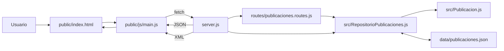
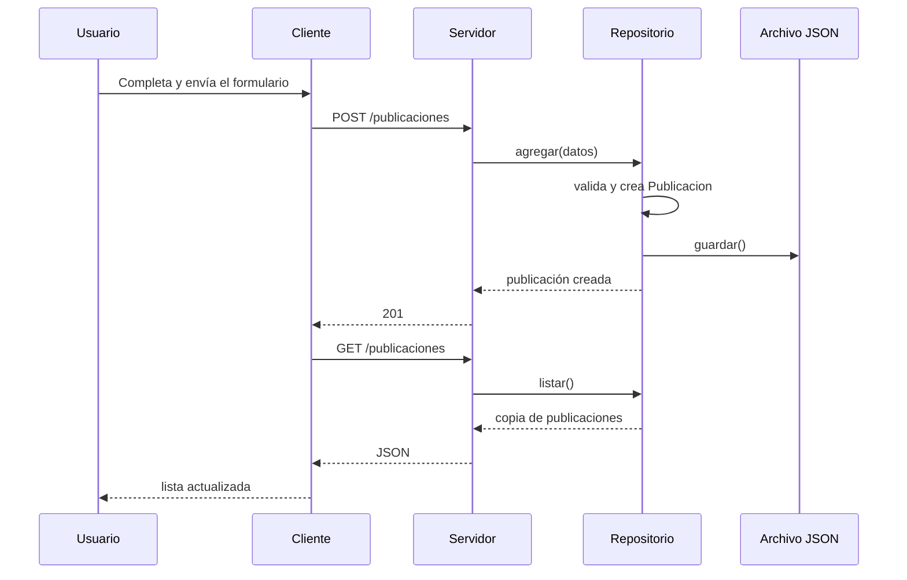

# Gestor de publicaciones

```mermaid
flowchart LR
  U[Usuario] --> H[public/index.html]
  H --> J[public/js/main.js]
  J -->|fetch| S[server.js]
  S --> R[routes/publicaciones.routes.js]
  R --> RP[src/RepositorioPublicaciones.js]
  S --> RP
  RP --> P[src/Publicacion.js]
  RP <--> D[data/publicaciones.json]
  S -->|JSON| J
  S -->|XML| J
  J --> H
```

```mermaid
sequenceDiagram
  participant U as Usuario
  participant C as Cliente
  participant S as Servidor
  participant R as Repositorio
  participant D as Archivo JSON
  U->>C: Completa y envía el formulario
  C->>S: POST /publicaciones
  S->>R: agregar(datos)
  R->>R: valida y crea Publicacion
  R->>D: guardar()
  R-->>S: publicación creada
  S-->>C: 201
  C->>S: GET /publicaciones
  S->>R: listar()
  R-->>S: copia de publicaciones
  S-->>C: JSON
  C-->>U: lista actualizada
```
