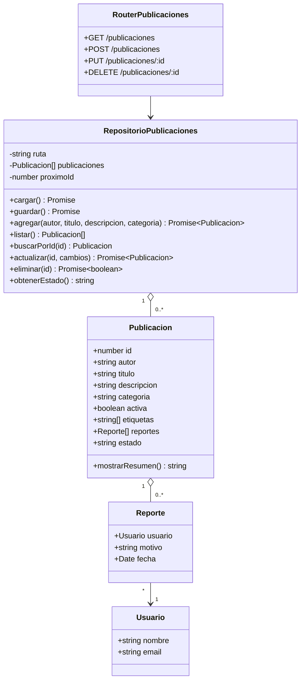
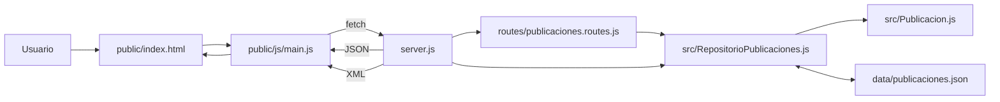
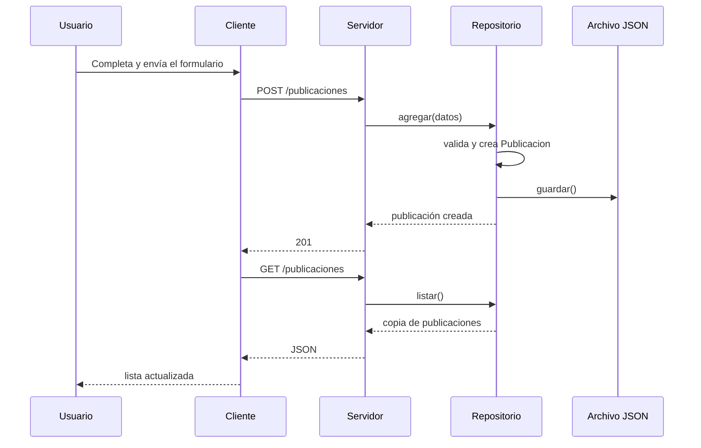

# Gestor de publicaciones

## Clases

```mermaid
classDiagram
  class Publicacion {
    +number id
    +string autor
    +string titulo
    +string descripcion
    +string categoria
    +boolean activa
    +string[] etiquetas
    +Reporte[] reportes
    +string estado
    +mostrarResumen() string
  }

  class RepositorioPublicaciones {
    -string ruta
    -Publicacion[] publicaciones
    -number proximoId
    +cargar() Promise
    +guardar() Promise
    +agregar(autor, titulo, descripcion, categoria) Promise~Publicacion~
    +listar() Publicacion[]
    +buscarPorId(id) Publicacion
    +actualizar(id, cambios) Promise~Publicacion~
    +eliminar(id) Promise~boolean~
    +obtenerEstado() string
  }

  class Reporte {
    +Usuario usuario
    +string motivo
    +Date fecha
  }

  class Usuario {
    +string nombre
    +string email
  }

  class RouterPublicaciones {
    +GET /publicaciones
    +POST /publicaciones
    +PUT /publicaciones/:id
    +DELETE /publicaciones/:id
  }

  RepositorioPublicaciones "1" o-- "0..*" Publicacion
  Publicacion "1" o-- "0..*" Reporte
  Reporte "*" --> "1" Usuario
  RouterPublicaciones --> RepositorioPublicaciones
```

## Flujo

```mermaid
flowchart LR
  U[Usuario] --> H[public/index.html]
  H --> J[public/js/main.js]
  J -->|fetch| S[server.js]
  S --> R[routes/publicaciones.routes.js]
  R --> RP[src/RepositorioPublicaciones.js]
  S --> RP
  RP --> P[src/Publicacion.js]
  RP <--> D[data/publicaciones.json]
  S -->|JSON| J
  S -->|XML| J
  J --> H
```

```mermaid
sequenceDiagram
  participant U as Usuario
  participant C as Cliente
  participant S as Servidor
  participant R as Repositorio
  participant D as Archivo JSON
  U->>C: Completa y envía el formulario
  C->>S: POST /publicaciones
  S->>R: agregar(datos)
  R->>R: valida y crea Publicacion
  R->>D: guardar()
  R-->>S: publicación creada
  S-->>C: 201
  C->>S: GET /publicaciones
  S->>R: listar()
  R-->>S: copia de publicaciones
  S-->>C: JSON
  C-->>U: lista actualizada
```
